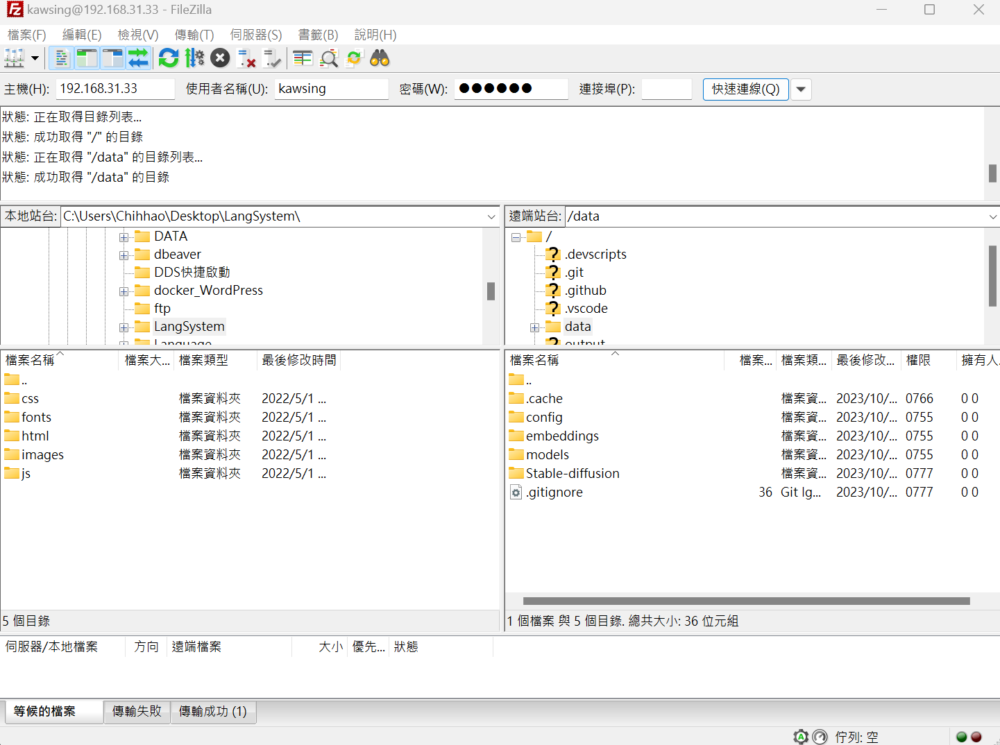

# docker-pure-ftpd
docker快速建立FTP

##簡易說明

利用https://hub.docker.com/r/stilliard/pure-ftpd/所提供的imges快速建立FTP可以限制只能取用那些資料夾

##使用方法:

    git clone https://github.com/h63016401/docker-pure-ftpd.git

    cd docker-pure-ftpd

修改docker-compose.yml文件

其中第10行:C:/Users/Chihhao/Desktop/stable-diffusion-webui-docker改成自己想要給ftp使用的本機資料夾

在12行中21:21 port可以修改成自己想要映射的

    docker compose up

開另一個終端機進入容器:

    docker exec -it ftpd_server /bin/bash

新增FTP使用者跟密碼:

    pure-pw useradd kawsing -f /etc/pure-ftpd/passwd/pureftpd.passwd -m -u ftpuser -d /home/ftpusers/kawsing

以上範例的使用者為:kawsing
連接到的預設目錄為:/home/ftpusers/kawsing

##使用 filezilla 測試

